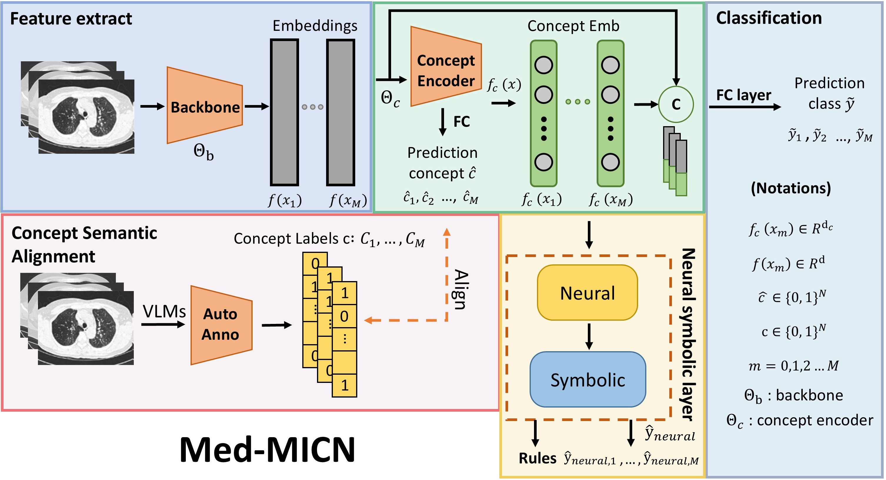
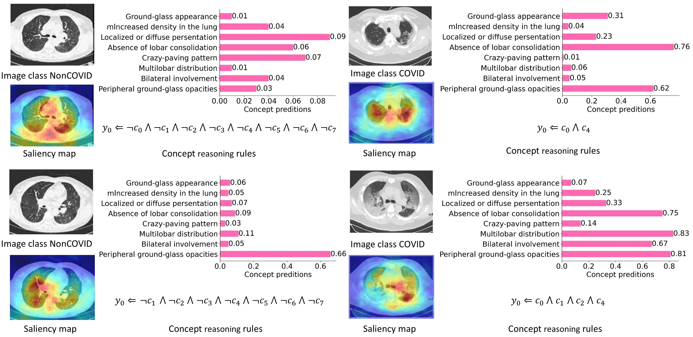

# Med-MICN: Towards Multi-dimensional Explanation Alignment for Medical Classification

**Paper:** [arXiv](https://arxiv.org/abs/2410.21494) · **Project page:** [https://xll0328.github.io/medmicn/](https://xll0328.github.io/medmicn/)

NeurIPS 2024. Official repository for [Towards Multi-dimensional Explanation Alignment for Medical Classification](https://arxiv.org/abs/2410.21494).

**Authors:** Lijie Hu†, Songning Lai†, Wenshuo Chen† (equal contribution), Hongru Xiao, Hongbin Lin, Lu Yu, Jingfeng Zhang, Di Wang

---

## Framework overview



Med-MICN consists of four primary modules: (1) **Feature Extraction Module** — image features via backbone (e.g. ResNet50, VGG19, DenseNet169). (2) **Concept Embedding Module** — concept encoder outputs concept embeddings and predicted category information. (3) **Concept Semantic Alignment** — VLM annotates image features and generates concept labels. (4) **Neural Symbolic Layer** — concept embeddings go to the neural symbolic layer for concept reasoning rules; then concatenated with image features for final prediction.

---

## Multi-dimensional interpretability



Concept score prediction, concept reasoning rules, and saliency maps achieve alignment within the interpretative framework (concepts $c_0, \ldots, c_7$ along the y-axis).

---

## Abstract

The lack of interpretability in medical image analysis has significant ethical and legal implications. Existing interpretable methods face challenges including dependency on specific models, difficulties in understanding and visualization, and efficiency issues. We propose **Med-MICN** (Medical Multi-dimensional Interpretable Concept Network), an end-to-end framework that provides interpretability alignment across neural symbolic reasoning, concept semantics, and saliency maps. Med-MICN achieves high prediction accuracy, multi-dimensional interpretability, and automation through an end-to-end concept labeling process that reduces the need for extensive human annotation on new datasets. Experiments on four benchmark datasets demonstrate superior performance and interpretability compared with other concept-based models and black-box baselines.

---

## Key formulas

Concept score from heatmaps (average pooling):

$$s_i = \frac{1}{H \cdot W} \sum_{h=1}^{H} \sum_{w=1}^{W} P_{h,w,i}$$

Concept embedding and prediction:

$$f(x_m) = \Theta_b(x_m), \quad f_c(x_m), \hat{C}_m = \Theta_c(f(x_m))$$

Neural-symbolic layer output (fuzzy logic):

$$\hat{y}_j = \land_{i=1}^{N} ( \neg I_{o, i, j} \lor I_{r, i, j} ) = \min_{i \in [N]} \{ \max\{1-I_{o, i, j} , I_{r, i, j}\} \}$$

Overall loss:

$$\mathcal{L} = \mathcal{L}_{\mathrm{task}} + \lambda_1 \cdot \mathcal{L}_{c} + \lambda_2 \cdot \mathcal{L}_{\mathrm{neural}}$$

where the task loss is CE for the fused prediction, the neural loss is BCE for the neural-symbolic prediction, and we use $\lambda_1 = \lambda_2 = 0.1$.

---

## Main results

| Method | Backbone | COVID-CT Acc./F1 | DDI Acc./F1 | Chest X-Ray Acc./F1 | Fitzpatrick17k Acc./F1 | Interpretability |
|--------|----------|------------------|-------------|---------------------|------------------------|-------------------|
| Baseline | ResNet50 | 81.36 / 81.67 | 77.27 / 72.77 | 75.64 / 71.72 | 80.79 / 80.79 | × |
| Baseline | VGG19 | 79.60 / 79.88 | 76.52 / 70.12 | **81.41** / **77.56** | 75.37 / 75.37 | × |
| Baseline | DenseNet169 | **85.59** / **85.59** | 78.03 / 69.51 | 69.55 / 61.66 | 76.85 / 76.83 | × |
| Label-free CBM | — | 69.49 / 69.21 | 70.34 / 69.21 | 71.21 / 70.84 | 75.24 / 75.41 | ✓ |
| DCR | — | 55.93 / 51.41 | 76.52 / 65.32 | 62.02 / 41.33 | 68.05 / 66.12 | ✓ |
| **Ours** | ResNet50 | **84.75** / **84.75** | **81.82** / **76.33** | 78.37 / 74.42 | **82.76** / **83.03** | ✓ |
| **Ours** | VGG19 | 83.05 / 84.37 | **82.58** / **78.07** | **88.30** / **88.16** | 77.34 / 77.53 | ✓ |
| **Ours** | DenseNet169 | **86.44** / **87.15** | 79.55 / 69.79 | 73.88 / 65.70 | 80.79 / **81.11** | ✓ |

---

## Dataset

Download the DDI dataset from [Stanford AIMI](https://stanfordaimi.azurewebsites.net/datasets/35866158-8196-48d8-87bf-50dca81df965).

### Dataset structure

```
DDI/
├── images/
│   ├── 000001.png
│   ├── 000002.png
│   └── ...
├── ddi_metadata_concept.csv
└── ddi_metadata.csv
```

---

## Usage

```bash
# Training with different backbones
python train_skin_neural.py --backbone RN50
python train_skin_neural.py --backbone DenseNet
python train_skin_neural.py --backbone DINOv2

# DDI baseline (train_skin_black.py)
python train_skin_black.py --image_dir <path_to_DDI_images>
```

---

## Citation

```bibtex
@inproceedings{hu2024medmicn,
  title={Towards Multi-dimensional Explanation Alignment for Medical Classification},
  author={Hu, Lijie and Lai, Songning and Chen, Wenshuo and Xiao, Hongru and Lin, Hongbin and Yu, Lu and Zhang, Jingfeng and Wang, Di},
  booktitle={Advances in Neural Information Processing Systems (NeurIPS)},
  year={2024}
}
```

- **Paper:** [arXiv](https://arxiv.org/abs/2410.21494)
- **Project page:** [https://xll0328.github.io/medmicn/](https://xll0328.github.io/medmicn/)
